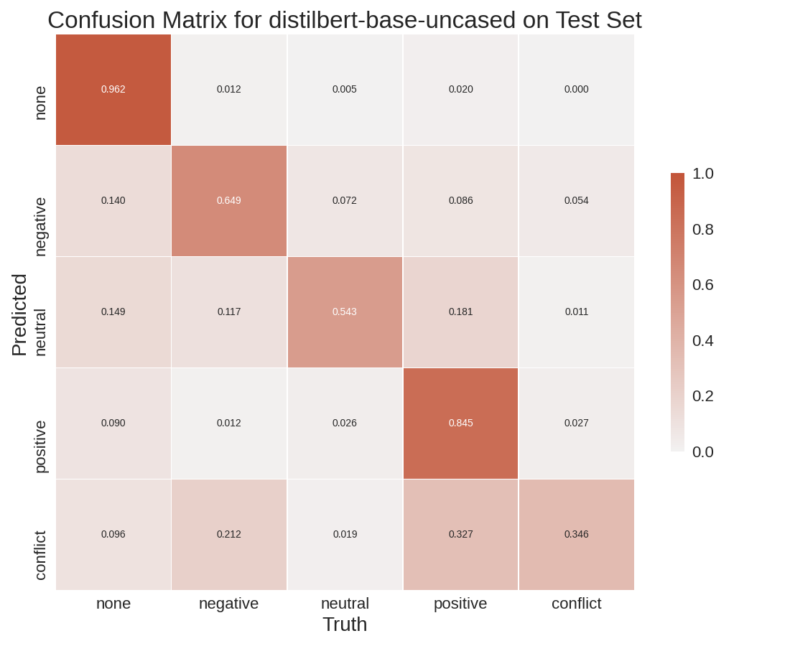
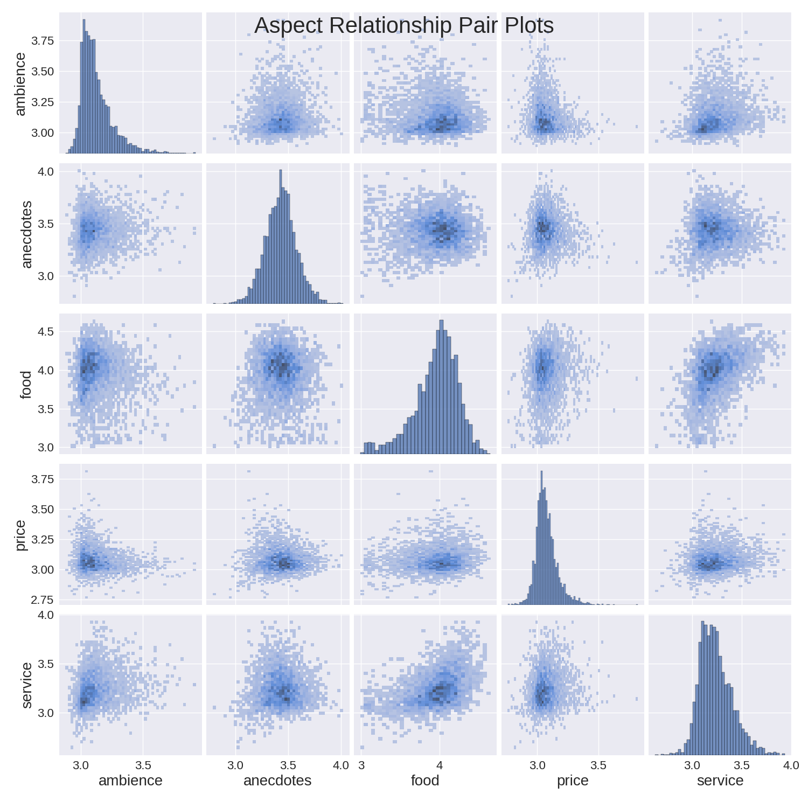
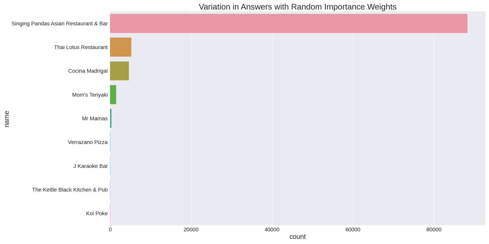

# Yelp: Aspect-Based Sentiment Analysis
Exploring the Yelp dataset using Aspect-Based Sentiment Analysis.

## Installation
```sh
$ pip install -r requirements.txt
```


## Run
First run the setup script to make all the proper file and directories as well as
download the Yelp dataset from Kaggle.
```sh
$ python setup.py
```

Then train the model by running the following script,
```sh
$ python train.py --model-id=distilbert-base-uncased --epochs=4 --batch-size=24 --lr=5e-2
```


Run trained model over all tips in the Yelp dataset.
```sh
$ python run.py --model-id=distilbert-base-uncased --batch-size=15
```




Generate all charts, shown in the Medium article, that are associated with your trained model.
```sh
$ python make_charts.py --model-id=distilbert-base-uncased
```


Find out your results by choosing your importance weight for each aspect of a restaurant.
```sh
$ python find.py --model-id=distilbert-base-uncased --importances=7,9,10,5,5,2
```




### References
* https://arxiv.org/pdf/1903.09588v1.pdf
* https://alt.qcri.org/semeval2014/task4/index.php?id=data-and-tools
* https://www.yelp.com/dataset/download
